#Workplace Environmental Monitor Reference Deployment


This document contains the current information you need to configure your Workplace Environmental Monitor and set it up so you can demonstrate its functionality to a group.

The monitor has sensors for:

* Temperature
* Humidity
* Light brightness

To turn the device on/off locate power switch on the side of the device next to the micro USB port. When fully charged it can run for several hours on internal battery, or it can be connected to a power source via the micro USB port for power/charging.

When turned on, it connects to the Wi-Fi access point it was configured to. Because of this it will probably not be able to connect to the internet the first time you turn it on. You will have to follow the instructions below to flash the board with your mbed credentials and needed Wi-Fi access point and password.

The documentation on this page shows how to flash software onto the device and also how to do wireless updating of the firmware (also known as "firmware over the air" updates).

##Flashing a Firmware Image
You need to flash the firmware at least once because it's the only way to get your device associated with your mbed cloud account. We have a web page setup that compiles the image for you, so you will only need to drag-and-drop the file onto your device.

####Required Hardware:

* Laptop with USB port (or dongles to provide a USB port)
* USB to Micro USB cable
* The environmental monitor device itself 

####Required file:

* An mbed cloud certificate file. First visit https://portal.us-east-1.mbedcloud.com/signup to sign up if you haven't already.
To get an mbed cloud certificate file, first sign in at https://portal.us-east-1.mbedcloud.com/

Click "Device identity", then click on "Actions", then click on "Create a developer certificate":

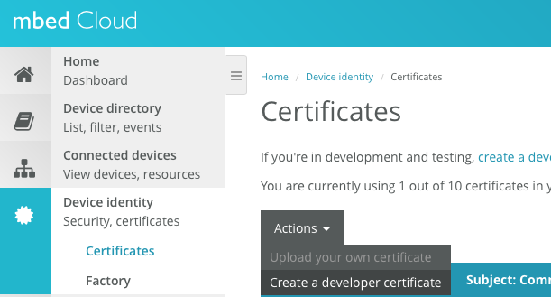

Then click on the certificate, and then click the button "Download the developer C file":

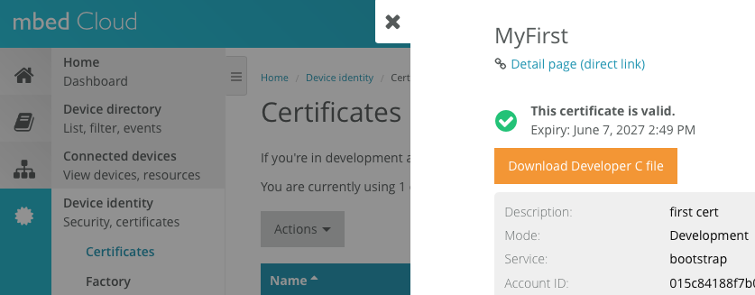

####Now that you have an mbed developer C file, follow the rest of these steps to flash your device:

1. Connect laptop via USB cable to the device. The laptop should automatically add a new drive, in this case named "DAPLINK". This is where you will drag-and-drop the firmware:

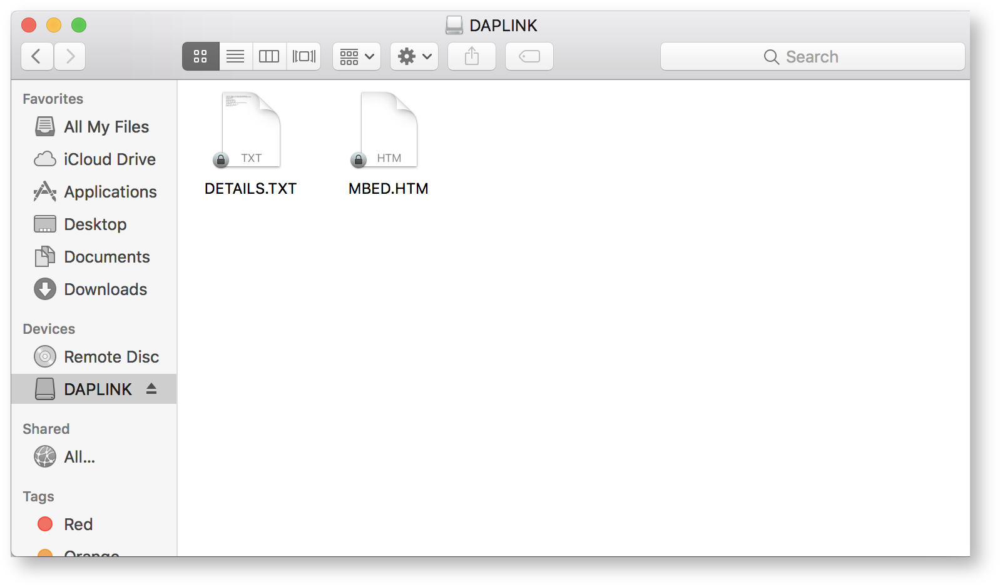

2. Visit FOTA Demo Firmware builder: https://jenkins-internal.mbed.com/view/RedTeam/job/RedFotaDemo/build

3. Next to "mbed_cloud_creds.c" click the "Choose file" button. Select your mbed credentials file. It will get built into the image.

4. Set the "wifi" parameters as you need.

5. Set "display version" to any name you want, like "Smith" (this will be displayed on the LCD.

6. Click the blue "Build" button.

7. You will then see a new build started with a progress bar:

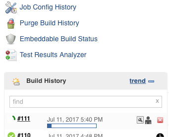

8. Click on the number of your build (e.g. "#111").

9. After about 3 minutes, your build will finish. There is a file you need to download called "combined-1.bin":

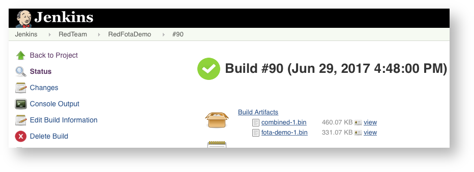

10. Save that file to your computer, then drag-and-drop it into the drive for your device (see step #1).

That's it! Wait about a minute and the device is now flashed with your image.

##Using the command console on the device
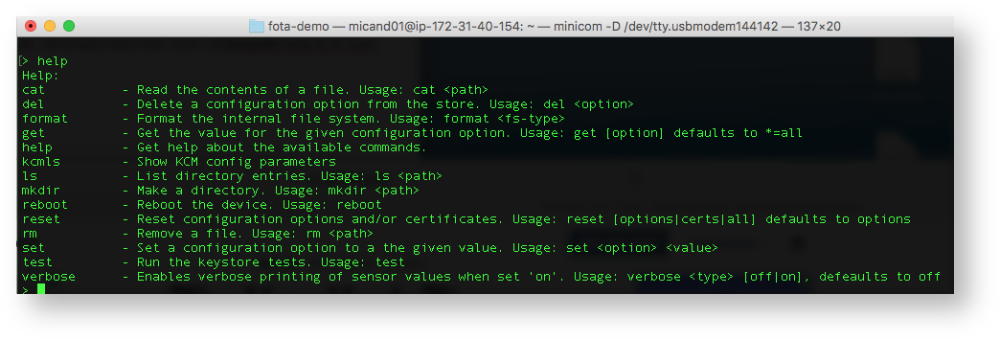

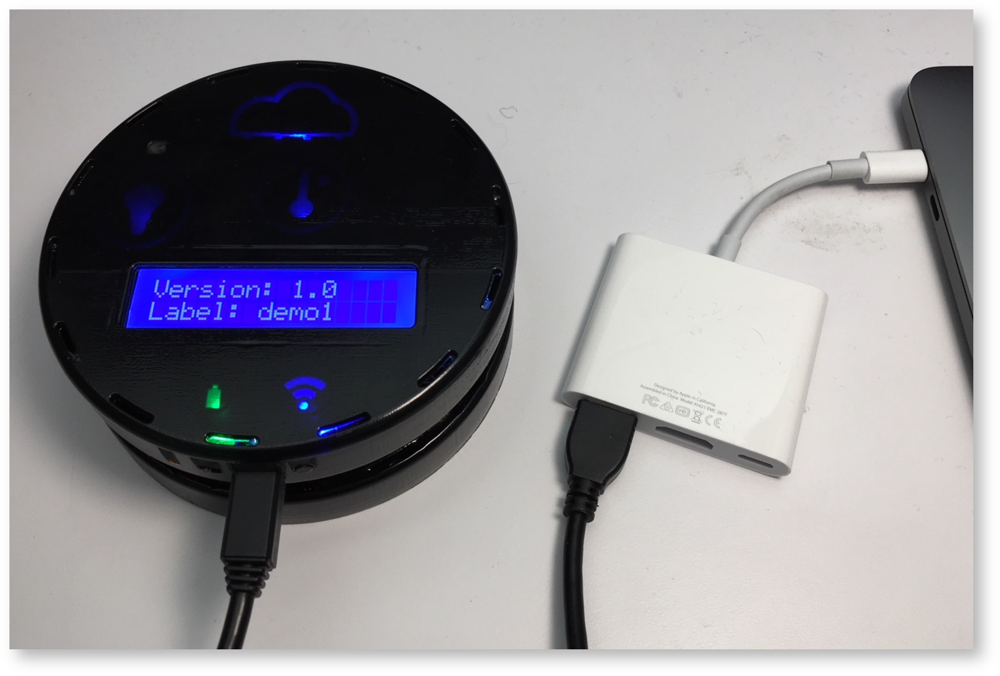

Connect your device to your laptop via a USB cable. Then you can use software such as PuTTy, Coolterm, or Minicom to connect to the device.


On macbook for example, you can type a command such as:
```
    minicom -D /dev/tty.usbmodem144142
```
To set the Wi-Fi configuration:

Press the ENTER key and you should see a prompt where you can type "help" to see all the available commands.
```
    set wifi.ssid NAME
    set wifi.key PASSWORD
    set wifi.encryption TYPE
```
You need to replace NAME with the displayed name of your access point and similiar with PASSWORD. The TYPE should be wither WPA2 or OPEN are the two most popular modes.

Type "reboot" to let the device boot up and attemp to connect to the Wi-Fi access point you specified.

##Firmware over-the-air update (FOTA) using jenkins
1. Visit FOTA Demo Firmware builder: https://jenkins-internal.mbed.com/view/RedTeam/job/RedFotaDemo/build
2. Next to "mbed_cloud_creds.c" click the "Choose file" button. Select your mbed credentials file. It will get built into the image.
3. Set the "wifi" parameters as you need.
4. Increase "number_of_versions" to "2".
5. Click the blue "Build" button.
6. After the build finishes, here are the list of artifacts:
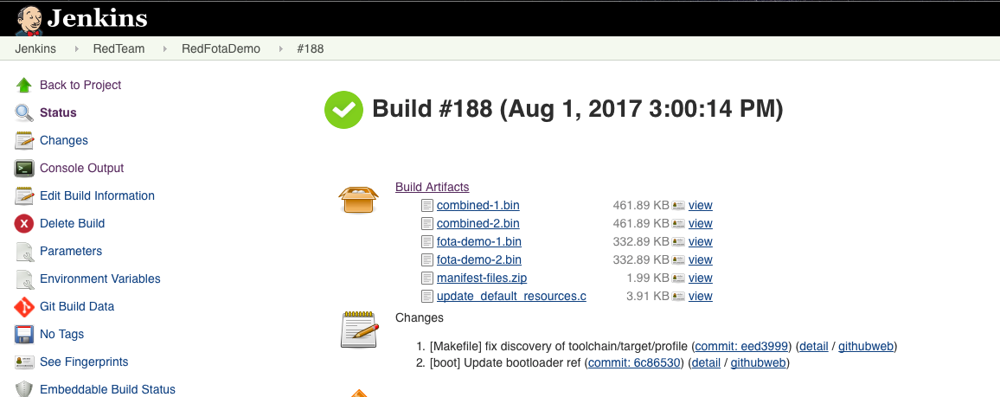
7. Download "combined-1.bin", drag-and-drop to device drive.
8. On device, reboot after flashing finishes. Open device console (baudrate 115200), type "reset all", then reboot device again.
9. Wait for device to boot up, connect to Wii, and connect to mbed cloud.
10. Download "fota-demo-2.bin", upload to mbed cloud portal.
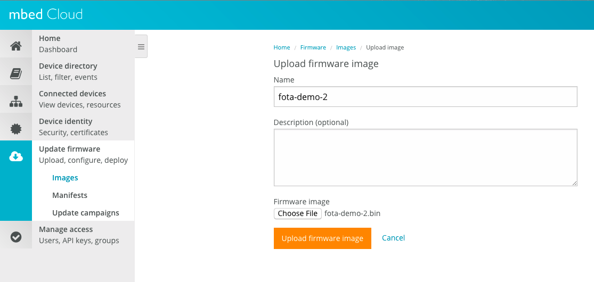
11. After upload image, there should be an URL generate for the image <image_URL>
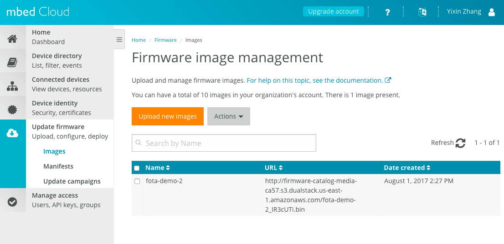
12. In Jenkins, download the Build Artifacts "manifest-files.zip" to local directory
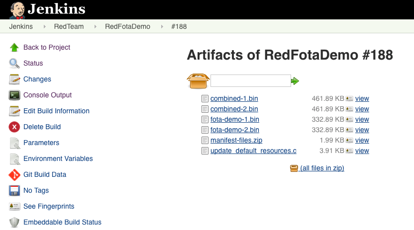
13. Under local directory:
    * unzip archive.zip
    * cd archive
    * unzip manifest-files.zip
    * cd manifest-files
14. Create the manifest.  From a command line console on a PC, type the following command:
    ```
    manifest-tool create -u <image_URL> -o manifest.v2 -p <path/to/fota-demo-2.bin>
    ```
    * <image_URL> is the URL from step 11
    * <path/to/fota-demo.bin> is the path to fota-demo-2.bin downloaded in step 10
    * manifest.v2 is the name of the manifest file to create and can be changed as appropriate

For instructions on how to obtain and use manifest-tool, see 

https://cloud.mbed.com/docs/v1.2/updating-firmware/manifest-tool.html

1. Upload manifest to mbed cloud portal.
Example Deployments Team > Workplace Environmental Monitor Reference Deployment > Screen Shot 2017-08-01 at 2.44.47 PM.png
2. Create Campaign, choose the manifest just uploaded, save and start.
Example Deployments Team > Workplace Environmental Monitor Reference Deployment > Screen Shot 2017-08-01 at 2.47.23 PM.png

##Demo Script

####Preparation (from a brand new board set)

1. Plug in the device to laptop, see if it show up as DAPLINK, if not, follow the instruction to update board firmware:  https://blackstoneengineering.github.io/DAPLink/
2. Copy "combined.bin" to board, wait for the board to flash.
3. Open board console (baudrate 115200). In console, enter "reset all" then "reboot".

####Pre-Demo check

1. When power on the board, see the power LED on GREEN, LCD on, and first line is the "Version".
2. When the board is trying to connect Wi-Fi, see the Wi-Fi LED flashing YELLOW, and on LCD second line, the SSID of the Wi-Fi will be show in "Wi-Fi"
3. When the board is connected to the Wi-Fi, see the Wi-Fi LED on BLUE.
4. When the board is trying to connect to the mbed cloud, the cloud LED flashing YELLOW, and sensor LEDs on BLUE. Sensor data/Wi-Fi SSID/Label name should be paging on the second line of the LCD.
5. When the board is connected and registered to the mbed cloud, the cloud LED on BLUE, and the sensor and cloud LEDs will flash GREEN in turn to show the sensor data uploaded.
6. Connect account to webapp hook. Open the webapp, see the device updating sensor data on the page.
7. Create campaign. When the board is trying to download firmware, see the data/update LED flashing YELLOW, LCD show "Downloading" with progress bar.
8. After image been downloaded to the board and board resets, all LEDs turn off, then the power LED back on GREEN, the data/update LED flashing YELLOW, while LCD show the 5 steps of the install progress: 
    * [1/5] CHK Flash 
    * [2/5] Erasing"
    * [3/5] Write HDR
    * [4/5] Write FW
    * [5/5] CHK Active
9. After install finishes, board will restart with LCD shows the latest "Version".

State Diagram detailing indicators in all states of the sales demo

####Demo

* First Boot
    1. Turn on power to device
    2. Show LCD and say, "It's trying to connect to Wi-Fi, and then it will register with mbed cloud. Once this LED shows blue, it is all connected and registered."
    3. Once device connects, show LCD, "You can see sensor values shown here. Temperature, Humidity, and Light."
    4. Open web browser on laptop to  https://portal.us-east-1.mbedcloud.com/login
    5. Login with mbed credentials
    6. Click "Device directory", and click on the registered "Device ID". Say, "Here in mbed cloud, we can see the live sensor values."
    7. Click on the "Resources" tab and scroll down to "Object ID 3301" which contains "light_value".
    8. Click on the path next to "light_value". Say, "This is the light sensor. Let me cover it up."
    9. Cover light sensor with hand, and the value on mbed cloud should change within seconds.
    10. Open web browser tab to http://staging.fotaportal.deploymbed.com/live-device/ "You don't have to login to mbed, cloud, you can create your own website. Here we've created an example. You can see Temperature, Light, and Humidity."
    11. Wait for applause.
* Location 
    1. With web browser still open to http://staging.fotaportal.deploymbed.com/live-device/ click on "Find Device" link near top
    2. Zoom in on map to show location of device
    3. Say, "We can manually change this."
    4. Open web browser tab to  https://portal.us-east-1.mbedcloud.com/login
    5. Click on "Device Directory"
    6. Click on the correct "Device ID"
    7. Click on "Resources" tab
    8. Scroll down to "Object ID 3336"
    9. Click on link next to "Latitude" (Specifically "3336/0")
    10. Click "edit" type in a number (like 30) and click "Send" button
    11. Do similar steps for "Longitude" and "Uncertainty"
    12. Go back to map at http://staging.fotaportal.deploymbed.com/live-device/find/
* Change device label (name)
    1. Open web browser tab to  https://portal.us-east-1.mbedcloud.com/login
    2. Click "Device Directory"
    3. Click the "Device ID"
    4. Click "Resources" tab
    5. Scroll down to "Object /26241/0/1"
    6. Click on the object
    7. Click Edit and change value
    8. Click "Send"
    9. Point to device LCD and show the device name changed there
    10. Also show name changed on http://staging.fotaportal.deploymbed.com/live-device/
* Firmware over-the-air updating.
    1. Open web browser tab back to mbed cloud portal
    2. Click on "Device directory"
    3. Click "Create new filter"
    4. Click "Add attribute"
    5. Click "Device ID"
    6. Copy-paste Device ID into the text field
    7. Click "Save filter"
    8. Type in a name and click "Save"
    9. Click on "Update firmware"
    10. Click on "Images"
    11. Click button, "Upload new images"
    12. Type in a name, then click "Choose file" and select file on your computer "fota-demo.bin" (not the combined.bin file!)
    13. Click on "Manifests"
    14. Click button, "Upload new manifest" and fill out the form.
    15. Click on "Update campaigns"
    16. Click on "Create campaign"
    17. Type in a name, select "Manifest" and select "Devices" filter
    18. Click "Save"
    19. Say, "Now I will update my devices". Click "Start".
    20. Device will update and reboot, displaying the new "version" name.

